# VR_Assignment1_BysaniAkshaya_IMT2022579
## Dependencies
- Ensure you installed required dependencies.
  ```
  pip install opencv-python numpy matplotlib
  ```
## How to run the code 
- The assignment is done in google colab.
- **Part 1**
  - The code for part 1 is in the file VR_a1_q1.ipynb of the folder "part1".
  - The images required are present in the same folder.
  - Ensure you are in the same directory before running the code.
  - For each cell do "Shift + Enter" to run the code present in that cell.
  - The output images for part 1 is placed in the "output" folder in "part1" folder.
- **Part 2**
  - The code for part 2 is in the file VR_a1_q1.ipynb of the folder "part2".
  - The images required are present in the same folder.
  - Ensure you are in the same directory before running the code.
  - For each cell do "Shift + Enter" to run the code present in that cell.
  - if the images need to be changed, put the required input images into the respective folder and change the paths of the images in the code.
  - The output image for part 2 is placed in the "output" folder in "part2" folder.

## Part 1 : Use computer vision techniques to Detect, segment, and count coins from an image containing scattered Indian coins.

### a. Detecting all coins in the image.

#### Preprocessing 
- Loading the input image
  
 
  
- Converting the image into **grayscale**.
  
 
  
- Applying **gaussian blur** with parameters grayscaled image, kernel size (5, 5), standard deviation 0 to smooth the image.
  
 

- **Otsu's thresholding** is used to binarize the image, converting it into a black-and-white format for easier segmentation.
- **Morphological closing** is applied to remove small holes and improve segmentation quality.

- .
 
- **Canny edge detection** is used to find the edges of coins in the image.

- 

- Contours are detected from the thresholded image to locate the coins using the inbuilt cv2 functions **findContours** and **drawContours**.

- 

### b. Segmentation of each coin.

Here segmentation has been performed using two methods:

#### Method 1: Contour based segmentation
- Uses contour area and convex hull to refine the detected coins and segment them.
- Helps in ensuring smooth boundaries by using convex hull operations.
- Filters out small noise by considering only contours within a specific area range.
- Crops and extracts individual coin images based on the bounding box of the contour.

#### Method 2: Region growing segmentation
- Uses flood fill to segment the coins based on pixel connectivity.
- Selects a seed point within the image to initiate the region-growing process.
- Expands regions by considering neighboring pixels with similar intensity values.
- Extracts segmented coins by applying the mask obtained from the flood fill operation.
- Helps in detecting connected components in cases where coin edges are not well-defined.

- **Output: Segmenting each coin**

<p align="center">
  
  
  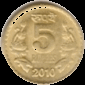
  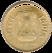
  
  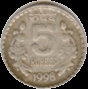
  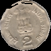
  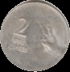
  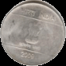
  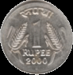
  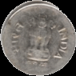
  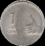
</p>

### c. Counting number of coins in the image

Each contour identify belongs to a different coin. Therefore, number of coins will be equal to the number of contours ientified.

## Part 2 : Create a stitched panorama from multiple overlapping images.
### Input images
  <p align="center">
  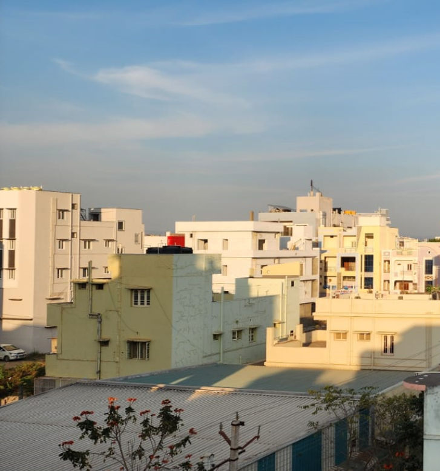
  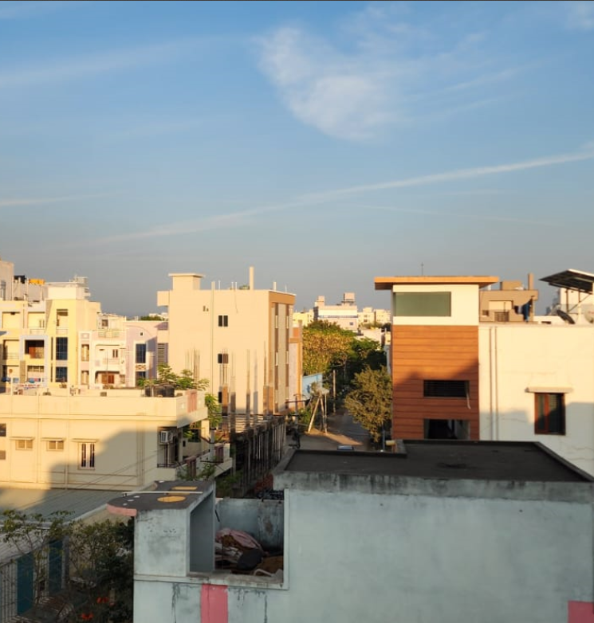
  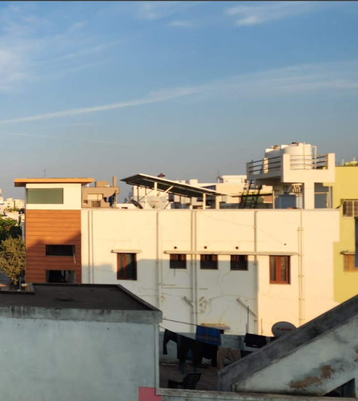
</p>

### a. Extract Key Points

- The function ```extract_keypoints_and_descriptors(images)``` processes the input images using ORB to detect keypoints and compute descriptors
  - Converts each image to grayscale.
  - Extracts keypoints and descriptors using ORB.
  - Displays the keypoints on the original images for visualization.
  - Keypoints of image 1. 
  - 
  - Keypoints of image 2.
  - 
  - Key points of image 3.
  - 

- The function ```match_keypoints(des1, des2, img1, img2, kp1, kp2)``` performs feature matching:
  - Uses the Brute Force Matcher (BFMatcher) with Hamming distance.
  - Matches descriptors between consecutive images.
  - Selects the top 50 best matches based on distance.
  - Displays the matched features between image pairs.
  - Feature matches between images 1 and 2.
  - 
  - Feature matches between images 2 and 3.
  - 


### b. Image Stitching
- The function ```warp_and_stitch(base_img, new_img, kp1, kp2, matches```) aligns images:
  - Extracts matching keypoint coordinates.
  - Computes a homography matrix using RANSAC.
  - Warps the new image to align with the base image.
  - Computes the bounding box and adjusts the transformation matrix to accommodate all images.
  - Combines the images into a single panorama.
- The function ```stitch_images(image_paths)``` manages the full stitching process:
  - Reads images from the given file paths.
  - Extracts keypoints and descriptors.
  - Iterates through image pairs, matching features and warping images.
  - Displays the final stitched panorama.
  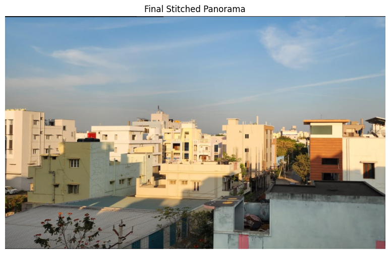

## Observations
- **Part 1**
  - Otsu's thresholding and Morphological closing helped in removing noise and better detection of contours.
  - Contour based segmentation gave better results than region growing segmentation.
- **Part 2**
  - ORB feature detection worked better for matching overlapping regions. 
