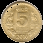
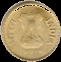
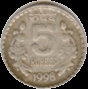
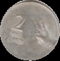
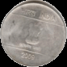
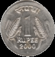
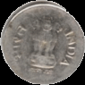
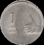

# VR_Assignment1_BysaniAkshaya_IMT2022579

Assignment is done in google colab.

## Part 1 : Use computer vision techniques to Detect, segment, and count coins from an image containing scattered Indian coins.

### a. Detecting all coins in the image.

#### Preprocessing 
- Loading the input image
  
- 
  
- Converting the image into **grayscale**.
  
- 
  
- Applying **gaussian blur** with parameters grayscaled image, kernel size (5, 5), standard deviation 0 to smooth the image.
  
- 

- **Otsu's thresholding** is used to binarize the image, converting it into a black-and-white format for easier segmentation.
- **Morphological closing** is applied to remove small holes and improve segmentation quality.

- .
 
- **Canny edge detection** is used to find the edges of coins in the image.

- 

- Contours are detected from the thresholded image to locate the coins using the inbuilt cv2 functions **findContours** and **drawContours**.

- 

### b. Segmentation of each coin.

Here segmentation has been performed using two methods:

#### Method 1: Contour based segmentation
- Uses contour area and convex hull to refine the detected coins and segment them.
- Helps in ensuring smooth boundaries by using convex hull operations.
- Filters out small noise by considering only contours within a specific area range.
- Crops and extracts individual coin images based on the bounding box of the contour.

#### Method 2: Region growing segmentation
- Uses flood fill to segment the coins based on pixel connectivity.
- Selects a seed point within the image to initiate the region-growing process.
- Expands regions by considering neighboring pixels with similar intensity values.
- Extracts segmented coins by applying the mask obtained from the flood fill operation.
- Helps in detecting connected components in cases where coin edges are not well-defined.

- **Output: Segmenting each coin**

  
  
  
  
  
  
  
  
  
  
  
  

### c. Counting number of coins in the image

Each contour identify belongs to a different coin. Therefore, number of coins will be equal to the number of contours ientified.
